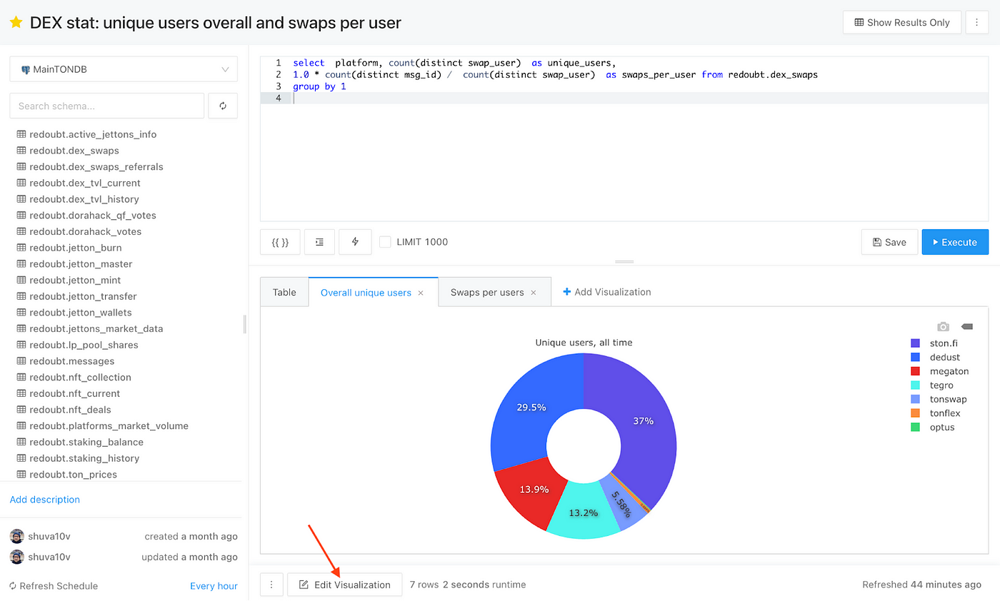

# TONalytica User Guide

[TONalytica](https://tonalytica.redoubt.online/) is a web-based platform that allows you to query TON blockchain data and aggregate it into beautiful 
dashboards.

TON are open and transparent, but TVM blockchains are unique—making it difficult to understand, ingest, and aggregate data. TONalytica gives you the proper tools to analyze cross-chain data for different tokens, wallets, and protocols. You can also easily share your work with the community.

### Enjoy the power and comfort of TONalytica's query editor with powerful collaboration:

- Write queries in their natural syntax and explore schemas
- Live auto-complete and keyboard shortcuts
- Create snippets for elements you frequently use
- Results are cached for minimal running times
- Schedule auto-update times for results you rely on
- Use query results as data sources to join different databases

### Visualize as you will & create amazing dashboards:

Easily visualize your results in various formats: chart, cohort, pivot table, boxplot, map, counter, sankey, sunburst and word cloud
-- Gather info from multiple sources into thematic dashboards
-- Share your data-story with colleagues, other teams or external partners
--- Share dashboards on a URL or embed widgets anywhere you need for timely and contextual data

**Visualization types:** 
Charts: Line, Bar, Area, Pie, Scatter; Boxplot; Cohort; Sunburst; Word Cloud; Sankey; Map; Counter; Pivot Table; Funnel. 

Product: https://tonalytica.redoubt.online/ 

Documentation (incl. Python/JS SDK):https://docs.tonalytica.redoubt.online/

Python SDK: https://pypi.org/project/tonalytica-client/ 

Dashboards samples: https://beta.redoubt.online/research 

[**Aknowledgement:** This tutorial has been funded by TON Footstep #287](https://github.com/ton-society/ton-footsteps/issues/287)