## DEX Ecosystem key metrics

Here are the key metrics for the TON ecosystem - unique users, TVL, LPs count and tokens (Jettons) count. These metrics provide a rough overview, but a closer examination is necessary to fully understand how the ecosystem is growing.

### DEX stat: unique users overall and swaps per user
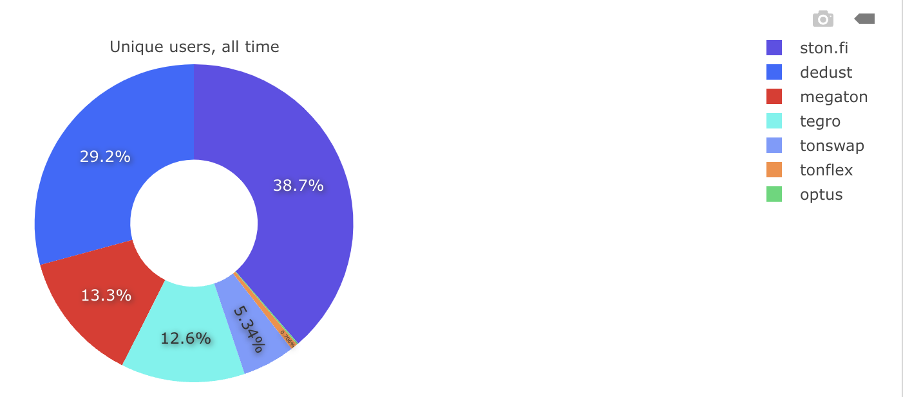

### Dex stat: active tokens
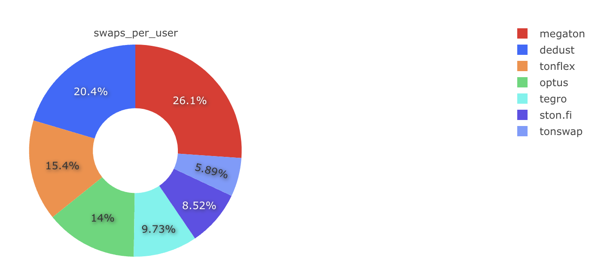

### DEX stat: WAU by platforms
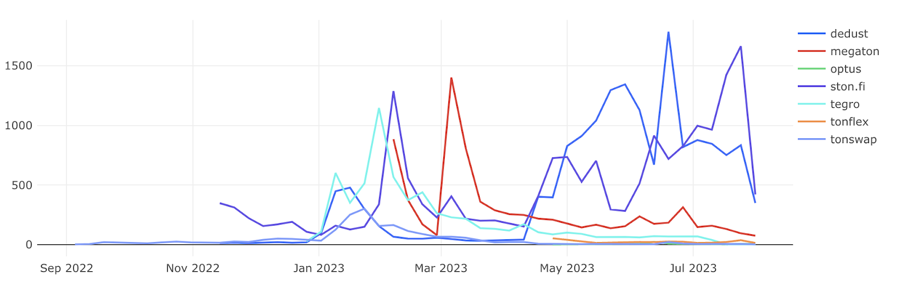

### DEX stat: new users weekly
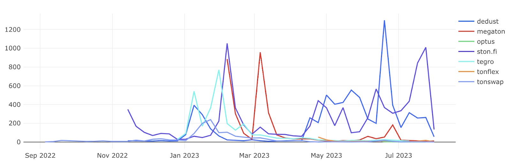

### DEX stat: number of DEXes user by user
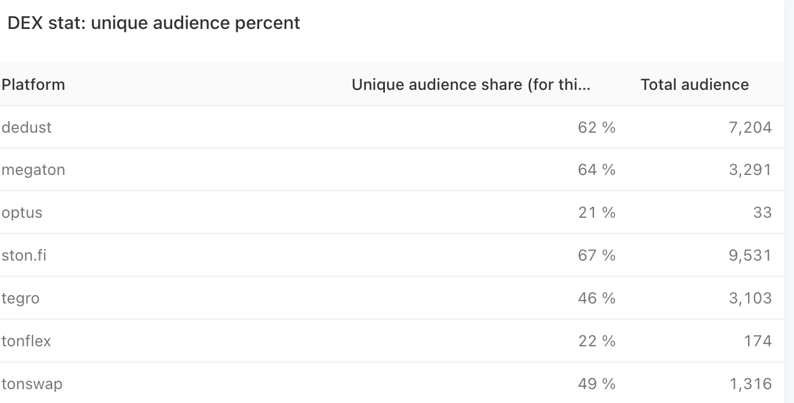

## TVL Jettons

### TVL Platforms Overview
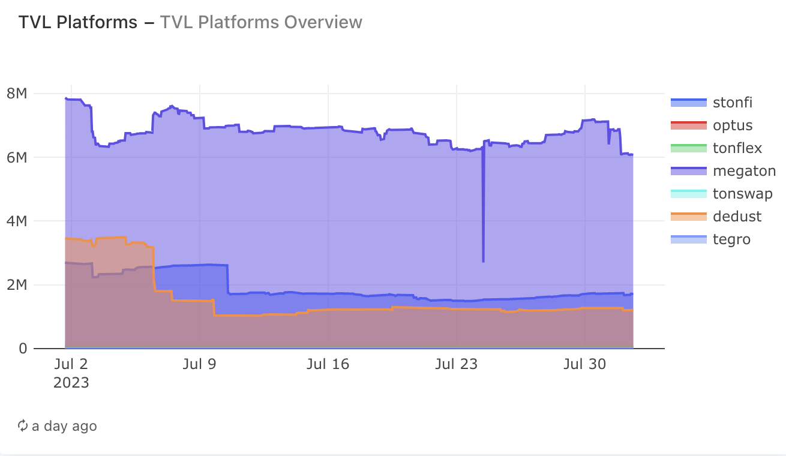

### TVL Platforms Distribution
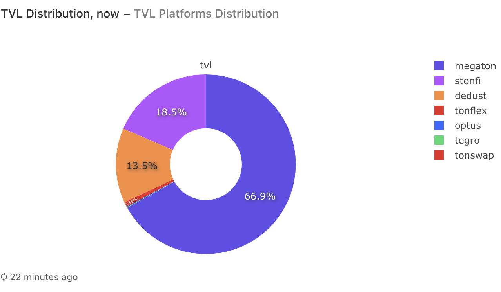

### TVL Orbit Bridge Jettons, top-10
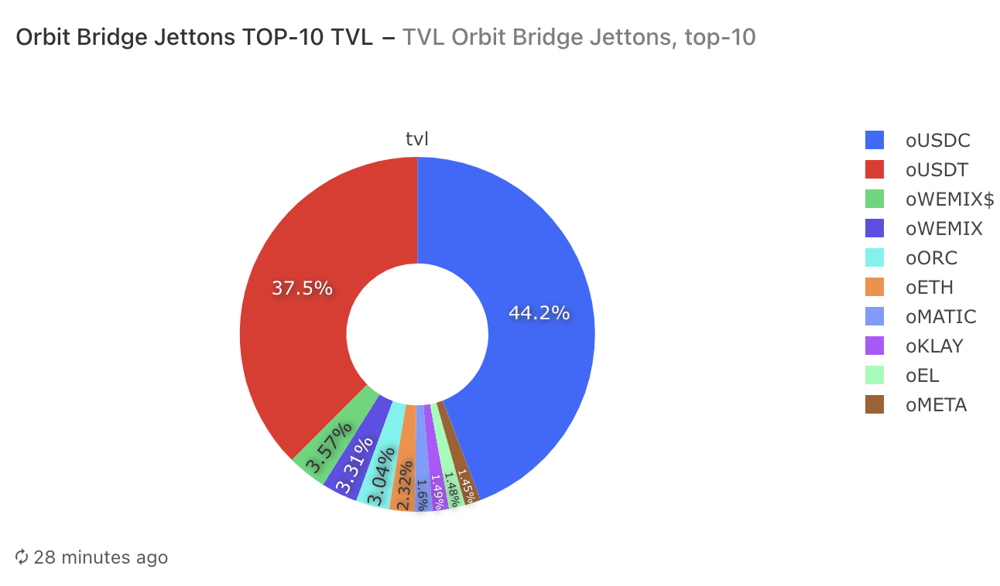

### TVL Native Jettons, top-10
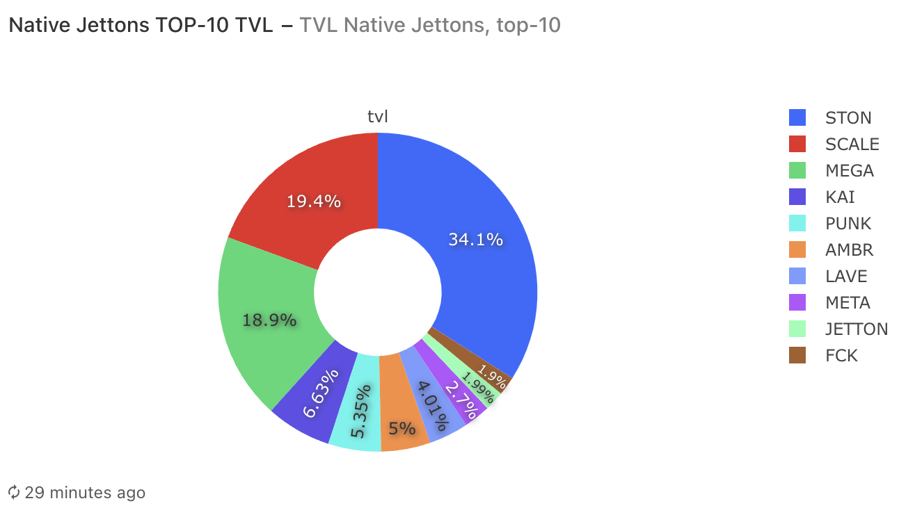

## Market Volumes Jettons

### Market Volume Platforms Overview
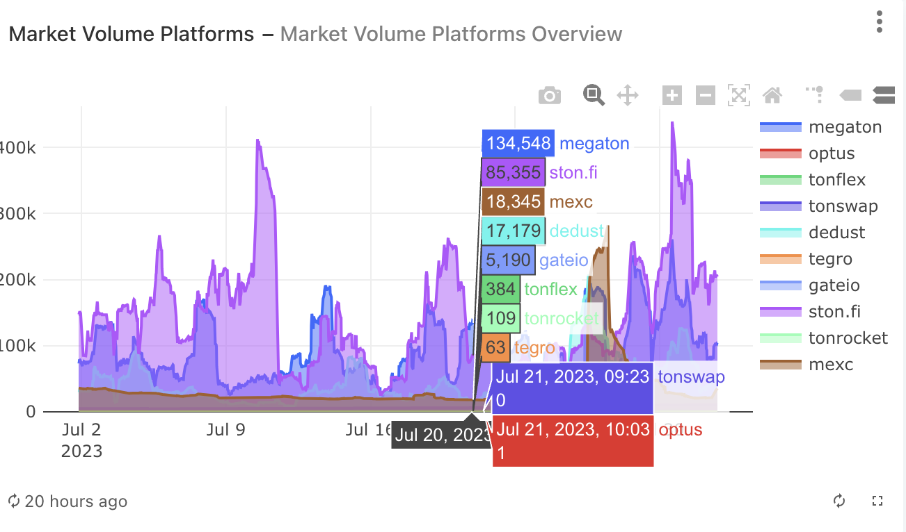

### Market Volume Platforms Distribution
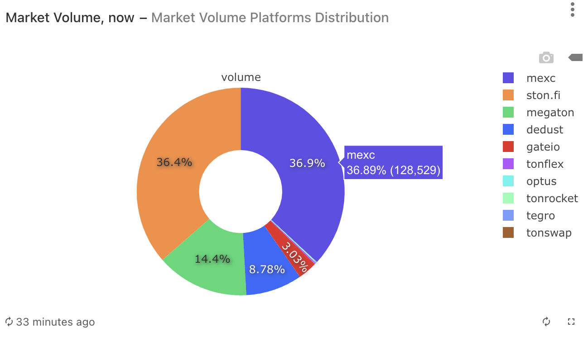

### Market Volume Native Jettons
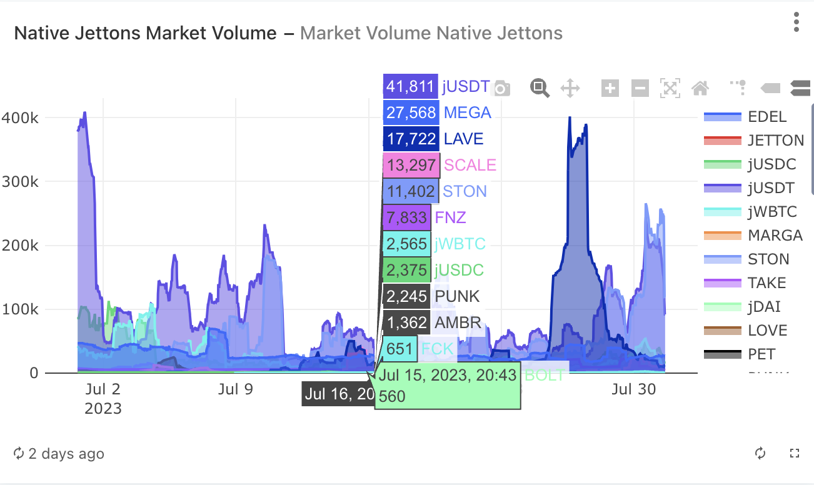

### Market Volume Orbit Bridge Jettons
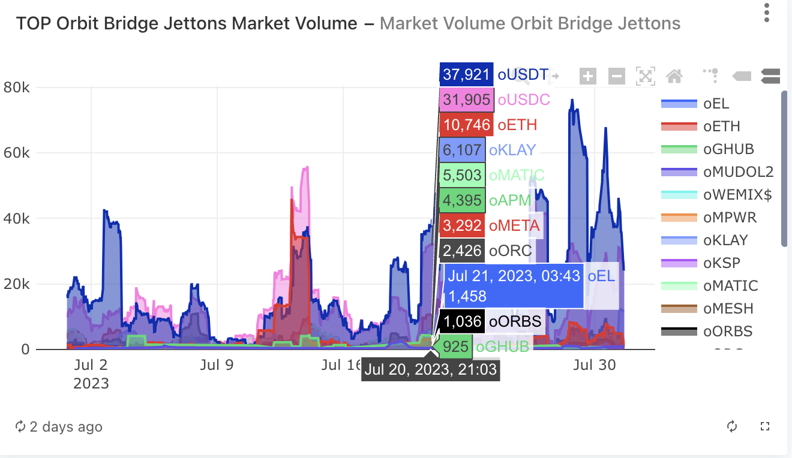